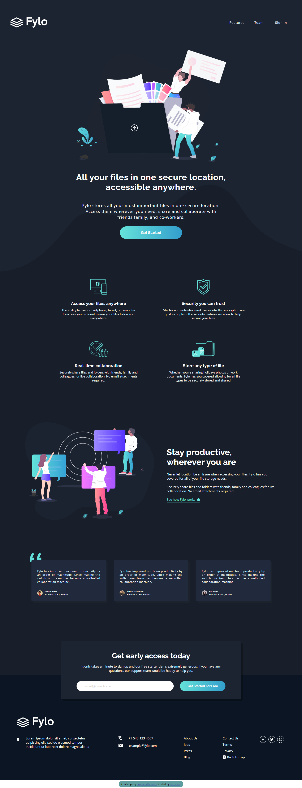
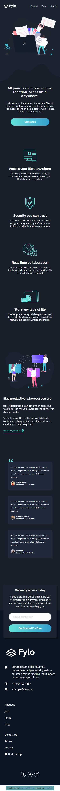

# Frontend Mentor - Fylo dark theme landing page solution

This is a solution to the [Fylo dark theme landing page challenge on Frontend Mentor](https://www.frontendmentor.io/challenges/fylo-dark-theme-landing-page-5ca5f2d21e82137ec91a50fd). Frontend Mentor challenges help you improve your coding skills by building realistic projects.

## Table of contents

-   [Overview](#overview)
    -   [The challenge](#the-challenge)
    -   [Screenshot](#screenshot)
    -   [Links](#links)
-   [My process](#my-process)
    -   [Built with](#built-with)
    -   [What I learned](#what-i-learned)
    -   [Continued development](#continued-development)
    -   [Useful resources](#useful-resources)
-   [Author](#author)
-   [Acknowledgments](#acknowledgments)

## Overview

### The challenge

Users should be able to:

-   View the optimal layout for the site depending on their device's screen size (in a range of 375px min, up to a max of 1440px)
-   See hover states for all interactive elements on the page

### Screenshot




### Links

-   Solution URL:<br>[Go to](https://github.com/TeusDev/devQuest_q02)
-   Live Site URL:<br>[Go to](https://teusdev.github.io/devQuest_q02/)

## My process

### Built with

-   Semantic HTML5 markup
-   CSS custom properties
-   CSS Flexbox
-   CSS Grid
-   FontsAwesome (using js to convert icons to svg)
-   Some Bootstrap icons

### What I learned

In this project i learned to use markup language in a syntactic and efficient way, with emphasis on the HTML5 that, aiming at the user experience, use css to demonstrate the validity and invalidity states in the form entries.

We used fontsAwesome library to render social media icons and a script (js) to convert them into the svg format.

Through research on StackOverflow, i learned how to create a circular line element around those icons, according to what was requested on the challenge example files.

Finally,

the use of media queries for switching Grid's into Flexbox when on mobile devices.

Here is some Code Snippets i'm proud of:

```html
<form>
	<input
		type="email"
		name="email"
		id="email"
		placeholder="email@example.com"
	/>
	<button type="button" class="heading">Get Started For Free</button>
	<span class="error">Please enter a valid email address</span>
</form>
```

```css
.mail_reg .container form .error {
	visibility: hidden;
	color: var(--error);
	/* hidden */
}
.mail_reg .container form input:not(:focus):invalid {
	border: 2px solid var(--error);
}
.mail_reg .container form input:not(:focus):invalid ~ .error {
	visibility: visible;
}
.mail_reg .container form input:not(:focus):not(:placeholder-shown):valid {
	border: 2px solid var(--cta_cyan);
}
```

### Continued development

-   Dive into Responsive: CSS Grid and Flexbox
-   Learn JS and improve the challenge with it

### Useful resources

-   [HTML5 forms validation notify using CSS](https://www.bram.us/2021/01/28/form-validation-you-want-notfocusinvalid-not-invalid/)<br>This helped me with the approach of informing the validation of HTML5 forms without using javascript.

-   [empty circle border around fontsAwesome icons](https://stackoverflow.com/questions/26065272/how-to-make-a-circle-with-css3-around-font-awesome-icon)<br>This helped me with the CSS of the social media icons. I really liked this approach and will use it for now.

## Author

-   [Github](https://github.com/TeusDev)
-   [Frontendmentor](https://www.frontendmentor.io/profile/TeusDev)
-   [Twitter](https://twitter.com/TeusDev)
-   [Instagram](https://www.instagram.com/teusdev)
-   [LinkedIn](https://www.linkedin.com/in/teusdev)

## Acknowledgments

I'd like to thank the teachers of the web development course i am taking,<br>and myself for not giving up and persevering in completing this challenge.
